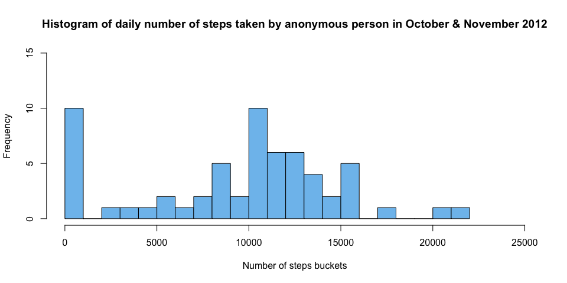
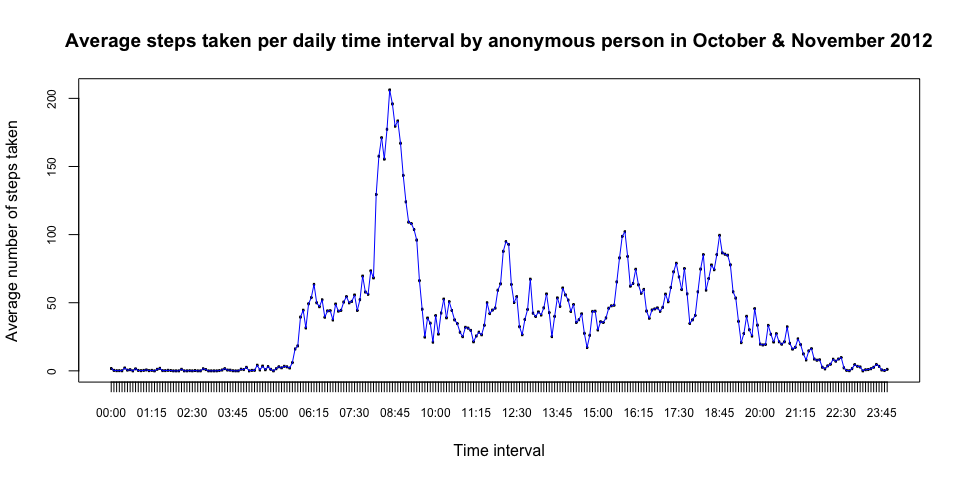
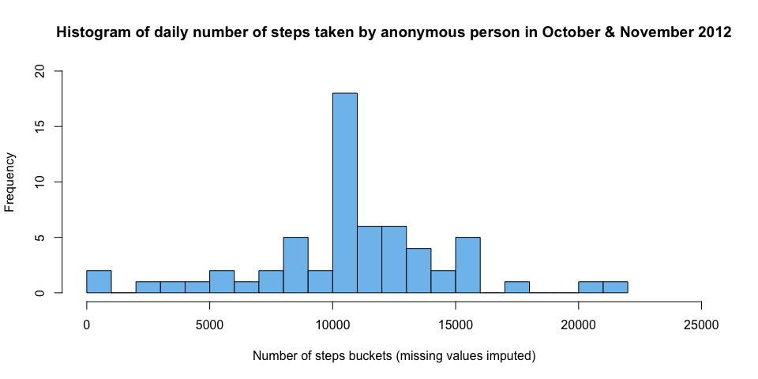
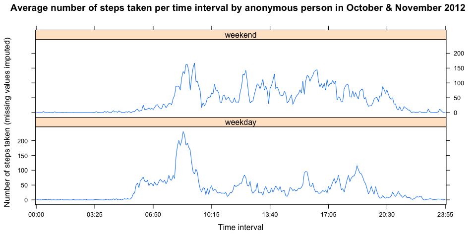

## Loading and preprocessing the data

```r
## First we load in the data
steps <- read.csv("activity.csv", na.strings = "NA")
## We turn the dates in the date column into date objects
steps$date <- as.Date(steps$date, "%Y-%m-%d")
## We nicely format the labels of the intervals as times ("00:00")
intervals <- formatC(steps$interval, width=4, flag="0") 
steps$interval <- as.factor(paste(substr(intervals, 1,2), ":", substr(intervals, 3,4), sep = ""))
```

## What is mean total number of steps taken per day?

```r
## We aggregate the data on a daily basis to get to the number of steps taken per day
stepsPerDay <- aggregate(list(steps = steps$steps), list(date = steps$date), sum, na.rm = TRUE)
## We create a histogram of the steps per day
barplot(height = stepsPerDay$steps, names.arg = format(stepsPerDay$date, "%m-%d"), cex.names = 0.75, col = "skyblue2", main = "Number of steps taken per day by anonymous person in October & November 2012", xlab = "Days in October and November 2012", ylab = "Number of steps taken per day")
```

<!-- -->

```r
## Next we need to report the mean and the median of the number of daily taken steps
mean(stepsPerDay$steps)
```

```
## [1] 9354.23
```

```r
median(stepsPerDay$steps)
```

```
## [1] 10395
```


## What is the average daily activity pattern?

```r
## We want to find out what the average number of steps taken is for each 5 minute interval in a day
## Therefore we aggregate on the 5 minute interval identifier and use the mean function
stepsPerInterval <- aggregate(list(steps = steps$steps), list(interval = steps$interval), mean, na.rm = TRUE)
## We create a line plot for the average number of steps per time interval
plot(x = stepsPerInterval, type = "n", cex.axis = 0.75, main = "Average steps taken per daily time interval by anonymous person in October & November 2012", xlab = "Time interval", ylab = "Average number of steps taken")
lines(x = stepsPerInterval$interval, y = stepsPerInterval$steps, col = "blue")
```

<!-- -->

```r
## Next we determine the maximum number of average steps across all time intervals
stepsPerInterval[stepsPerInterval$steps == max(stepsPerInterval$steps),]
```

```
##     interval    steps
## 104    08:35 206.1698
```


## Imputing missing values

```r
## We determine the number of rows which have a value NA
nrow(steps[is.na(steps),])
```

```
## [1] 2304
```

```r
## We replace the NA values by the mean value for that time interval across all days. 
## For this we need the dplyr package. 
library(dplyr)
```

```
## 
## Attaching package: 'dplyr'
```

```
## The following objects are masked from 'package:stats':
## 
##     filter, lag
```

```
## The following objects are masked from 'package:base':
## 
##     intersect, setdiff, setequal, union
```

```r
## We join the the stepsPerInterval data frame with the steps data frame on interval. 
## The stepsPerInterval data frame contains the mean for each time interval.
stepsImputed <- merge(x = steps, y = stepsPerInterval, by.x = "interval", by.y = "interval", all.x = TRUE)
## Then we mutate the steps column values by replacing the NA values with the mean values. 
stepsImputed <- mutate(stepsImputed, steps.x = ifelse(is.na(steps.x), steps.y, steps.x))
## This imputed data set we aggregate on date as we want the daily acitivity. 
stepsImputedPerDay <- aggregate(list(steps = stepsImputed$steps.x), list(date = stepsImputed$date), sum)

## Then we create a histogram of the steps per day for this imputed steps data frame.
barplot(height = stepsImputedPerDay$steps, names.arg = format(stepsImputedPerDay$date, "%m-%d"), cex.names = 0.75, col = "skyblue2", main = "Number of steps taken per day by anonymous person in October & November 2012", xlab = "Days in October and November 2012", ylab = "Number of steps taken per day (missing values imputed)")
```

<!-- -->

```r
## Next we need to report the mean and the median of the number of daily taken steps
mean(stepsImputedPerDay$steps)
```

```
## [1] 10766.19
```

```r
median(stepsImputedPerDay$steps)
```

```
## [1] 10766.19
```
It turns out that imputing the data in this data set significantly alters the mean, median and daily activity. This is not strange as the missing values constituted 13.1147541% of the rows of the raw data set.

## Are there differences in activity patterns between weekdays and weekends?

```r
## First we create a new factor variable with two levels: weekday or weekend
stepsImputed$typeOfDay <- as.factor(ifelse(weekdays(stepsImputed$date) %in% c("zaterdag", "zondag", "saturday", "sunday"), "weekend", "weekday"))

## We aggregate the steps on type of day and time interval
stepsPerTypeOfDayPerInterval <- aggregate(list(steps = stepsImputed$steps.x), list(interval = stepsImputed$interval, typeOfDay = stepsImputed$typeOfDay), mean)

## Now we create a lattice plot, we need the lattice package for that
library(lattice)

## We show the sum of steps based on time interval conditioned by type of day
xAxisSequence = seq(1,24*12,41)
xyplot(steps ~ interval | typeOfDay, stepsPerTypeOfDayPerInterval, type = "l", layout = c(1,2), xlab = "Time interval", ylab = "Number of steps taken (missing values imputed)", scales=list(x = list(at = xAxisSequence, labels = levels(stepsPerTypeOfDayPerInterval$interval)[xAxisSequence])), cex.names = 0.75, main = "Average number of steps taken per time interval by anonymous person in October & November 2012")
```

<!-- -->
